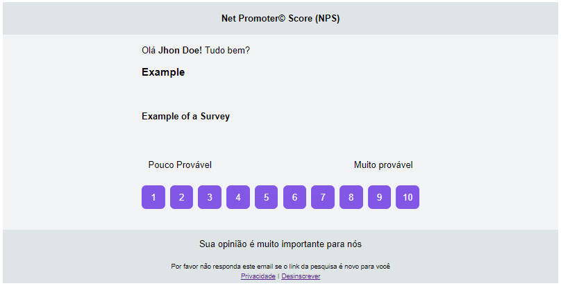

<div align="center">
  <br />
  <a href="https://nps-bmv1.onrender.com/"></a>
  <br />
  <p>
    
    
    <a href="https://github.com/thalesmacena/nps/commits/main">
      
    </a>
  </p>
</div>

## 🗂 Tabela de Conteúdo
- [🗂 Tabela de Conteúdo](#-tabela-de-conteúdo)
- [📑 About](#-about)
- [💻 Technologies](#-technologies)
- [✨ Installation](#-installation)
- [⚙️ Config](#️-config)
- [🔥 Running](#-running)
- [🤔 Test](#-test)
- [💡 API Specification](#-api-specification)
  
  
## 📑 About
Nps is a [Net Promoter Score](https://en.wikipedia.org/wiki/Net_Promoter) api. That measures the willingness of customers to recommend a company's products or services to others. It is used as a proxy for gauging the customer's overall satisfaction with a company's product or service and the customer's loyalty to the brand. **This application was made during the Next Level Week 4 presented by [Rocketseat](https://github.com/Rocketseat)**

You can check the api specification by [clicking her](https://nps-bmv1.onrender.com/)

The administrator can use requests for the api to create users and surveys. In addition they can create a pivo table to relate a user and a survey and thus send an email with the survey for this user to respond to. It is possible to retrieve the net promoter scores for each of the surveys.

This is the template of the email sent to the user:

<div align="center">

</div>

## 💻 Technologies

<a href="https://yarnpkg.com/"></a>

<a href="https://nodejs.org/en/"></a>

<a href="https://www.typescriptlang.org/"></a>

<a href="https://eslint.org/"></a>

<a href="https://expressjs.com/"></a>

<a href="https://typeorm.io/"></a>

<a href="https://jestjs.io/"></a>

<a href="https://www.sqlite.org/index.html"></a>

<a href="https://nodemailer.com/about/"></a>

<a href="https://handlebarsjs.com/"></a>


## ✨ Installation
Open a terminal and run the following commands:

```PowerShell
# To copy this repository
git clone https://github.com/thalesmacena/nps.git

# To move to project directory
cd nps

# To install the dependencies
yarn
```

## ⚙️ Config
You need to configure some environment variables, so rename the `.env.example` file to `.env`. Then you need to change the values for your database variables, I recommend using a docker container with postgres and the following environment variables:

```.env
# Database

DB_TYPE=postgres
DB_HOST=localhost
DB_PORT=5432
DB_USER=
DB_PASS=
DB_NAME=
```

renaming DB_USER, DB_PASS and DB_NAME respectively with the postgres username and password and the name of the database created. 

## 🔥 Running
First you need to create the tables in the database, by running the following command:
```Powershell
yarn typeorm migration:run
```

You can run the application in development mode with the command:
```Powershell
# To run
yarn dev
```

The application will run on [localhost:3000](http://localhost:3333/)

## 🤔 Test
You can also tests the aplication by run:
```PowerShell
yarn test
```

## 💡 API Specification
You can acess the api specification (OAS / Swagger) by [clicking her](https://nps-bmv1.onrender.com/) or render the OAS locally using the command:

```Powershell
yarn api
```

The api will render on [localhost:8080](http://localhost:8080/)